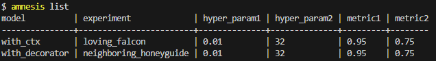

# Amnesis

Lightweight local experiments tracker. Provides:
- Simple CLI (init, list, models, experiments, delete)
- Python context / decorator to log hyperparameters & metrics
- Auto-capture of selected locals (optional) for fast iteration



## Install
You will first need to clone this repository. Then within the repository directory use:

```
pip install .
```

## Quick start (CLI)
```
# 1. Initialize inside your project root
amnesis init

# 2. Run your training script(s) that log experiments (see Python API below)

# 3. List experiments (long form)
amnesis list

# Short view (omit hyperparameters & metrics)
amnesis list --short

# List only experiments for a model
amnesis experiments --model my_model --hyperparameters --metrics

# List models
amnesis models

# Delete a model (removes all its experiments)
amnesis delete model my_model

# Delete a single experiment by UUID
amnesis delete experiment 1d2f3a4b-...
```

## Python API
Minimal example to record an experiment with a context manager.

````python
from amnesis.experiment_context import ExperimentContext
with ExperimentContext("demo_model") as ctx:
    ctx.log_hyperparameter("lr", 1e-3)
    # ... compute loss ...
    ctx.log_metric("loss", 0.25)
````

For a complete example, please refer to [`experiment_context.py`](./examples/experiment_context.py).

## Roadmap
- Git integration
- Export to CSV / Markdown

## Limitations
- Local only (no remote sync)
- Concurrency not yet optimized (avoid simultaneous writes to the same model directory)

## Contributing
Small, focused PRs welcome. Please refer to [`CONTRIBUTING.md`](./CONTRIBUTING.md) and make sure to run the linting tool and the tests.

## Disclaimer
This package is in its early stages of development and is subject to change. Features and APIs may evolve as the project matures.
